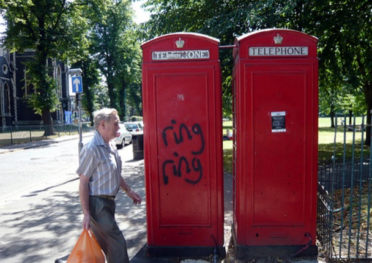
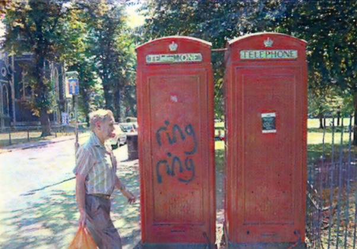
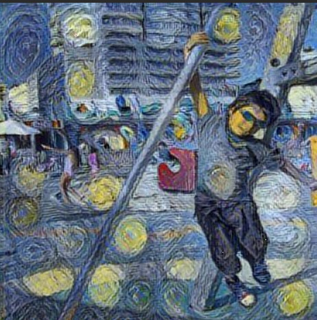
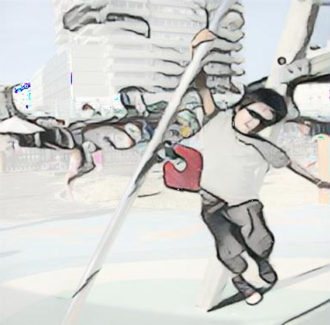
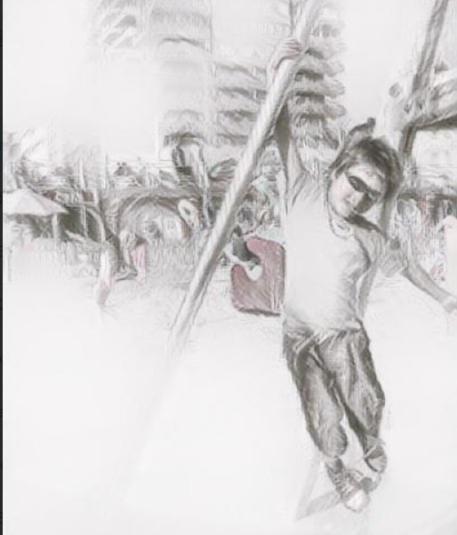

# 🎨 GAN Art Style Transfer

Transform your photos into famous painting styles using **CycleGAN** and **CartoonGAN** — powered by deep learning.


---

## 📌 Project Overview

This project applies **Generative Adversarial Networks (GANs)** to perform artistic style transfer on a dataset of 8000+ images. Using pretrained CycleGAN models, ordinary photos are converted into the styles of legendary painters such as Monet, Van Gogh, and Cézanne. A CartoonGAN model is also included for cartoon-style conversion.

---

## 🖼️ Styles Supported

| Style | Model |
|-------|-------|
| 🌊 Monet | CycleGAN (pretrained) |
| 🌻 Van Gogh | CycleGAN (pretrained) |
| 🍎 Cézanne | CycleGAN (pretrained) |
| 🎌 Ukiyo-e | CycleGAN (pretrained) |
| 🎨 Cartoon | CartoonGAN TFLite |

---

## 📁 Project Structure

```
GAN-Art-Style-Transfer/
│
├── README.md
├── requirements.txt
├── .gitignore
└── notebooks/
    ├── 01_CycleGAN_VanGogh.ipynb     # Van Gogh style transfer
    ├── 02_CycleGAN_Cezanne.ipynb     # Cézanne style transfer
    ├── 03_CycleGAN_Monet.ipynb       # Monet style transfer
    └── 04_CartoonGAN.ipynb           # Cartoon style transfer
```

---

## 🚀 How to Run

### 1. Open in Google Colab
All notebooks are designed to run in **Google Colab** with GPU support.

Click the badge below to open directly:  
[](https://colab.research.google.com/)

### 2. Mount Google Drive
Each notebook will prompt you to mount your Google Drive:
```python
from google.colab import drive
drive.mount('/content/drive')
```

### 3. Set Your Dataset Path
Update the `--dataroot` path to point to your images folder:
```
--dataroot /content/drive/MyDrive/GAN_ART_IMAGES/Images
```

### 4. Run All Cells
Execute all cells top to bottom. Results will be saved in:
```
./results/<style_name>_pretrained/test_latest/images/
```

---

## 📦 Dataset

- **Total Images:** ~8000
- **Format:** JPG / PNG
- **Source:** Custom dataset stored on Google Drive

> 📎 Dataset Link: [Google Drive Folder](https://drive.google.com/drive/folders/14dp4kEdV9k6esJs0tGTNb3AKFF6d-s9I?usp=sharing)

The dataset is **not included** in this repository due to size limitations. Please download it from the link above and place it in your Google Drive under `MyDrive/GAN_ART_IMAGES/Images/`.

---

## 🛠️ Dependencies

### For CycleGAN Notebooks:
```
torch
torchvision
torchaudio
dominate
visdom
pillow
```

### For CartoonGAN Notebook:
```
tensorflow
numpy
pillow
```

Install via:
```bash
pip install -r requirements.txt
```

---

## 🧠 Models Used

### CycleGAN
- **Paper:** [Unpaired Image-to-Image Translation using Cycle-Consistent Adversarial Networks](https://arxiv.org/abs/1703.10593)
- **Authors:** Jun-Yan Zhu, Taesung Park, Phillip Isola, Alexei A. Efros
- **Repo:** [junyanz/pytorch-CycleGAN-and-pix2pix](https://github.com/junyanz/pytorch-CycleGAN-and-pix2pix)
- **Pretrained weights** provided by the original authors

### CartoonGAN
- **Model:** TFLite pretrained model
- **Input size:** 256×256
- **Framework:** TensorFlow Lite

> ⚠️ **Note:** This project uses **pretrained weights** provided by the original CycleGAN authors. No custom training was performed. The contribution of this project is the application of these models to a custom dataset of 8000+ images and the comparison of multiple artistic styles.

---

## 📊 Results

These are **real outputs** generated by this project on our custom dataset.

---

### 🌊 Monet Style Transfer
| Original Photo | Monet Style Output |
|---------------|-------------------|
|  |  |

---

### 🌻 Van Gogh Style


---

### 🎨 Cartoon Style


---

### ✏️ Sketch Style


---

> ✅ All outputs above were generated using pretrained CycleGAN and CartoonGAN models on our custom dataset of 8000+ images.

---

## 🔧 Troubleshooting

| Problem | Solution |
|---------|----------|
| Model not found | Re-run the `download_cyclegan_model.sh` script |
| CUDA out of memory | Reduce `--num_test` or use `--preprocess scale_width` |
| Drive not mounting | Re-run the drive mount cell and re-authorize |
| TFLite model error | Ensure TensorFlow 2.x is installed |

---

## 👤 Author

**Uswa Fatima**  
📧 uswa93245@gmail.com  
🔗 [GitHub](https://github.com/codewithUswaFatima)

---

## 📄 License

This project is for **educational purposes only**.  
CycleGAN model weights are property of their respective authors.
